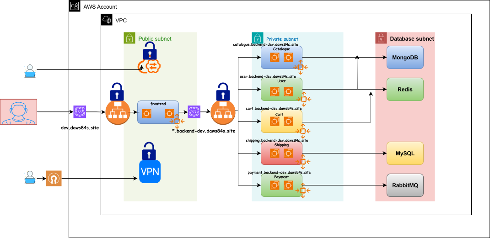

# 🚀 Roboshop Infrastructure Setup

## 📌 Overview

This repository provisions a **scalable microservices-based infrastructure on AWS using Terraform**, designed to simulate a real-world e-commerce platform.

The architecture focuses on **scalability, secure networking, and modular infrastructure**, enabling independent service deployment and efficient traffic routing across components.

---

## 💡 What This Project Solves

- Demonstrates a real-world microservices infrastructure setup on AWS  
- Shows how to implement path-based routing using ALB  
- Provides a scalable backend using Auto Scaling Groups  
- Implements secure networking with private subnets, Bastion, and VPN  
- Uses Infrastructure as Code (Terraform) for repeatable deployments  

---

## ⚙️ Key Highlights

* Multi-tier architecture (Frontend → Backend → Database)
* Path-based routing using ALB
* Auto Scaling based on CPU utilization
* Secure infrastructure with private subnets, VPN, and Bastion
* Modular Terraform design
* Configuration managed via Parameter Store
* CDN integration for performance optimization

---

## 🏗 Architecture

<!--  -->
<!--  -->
<p align="center">
  
</p>

---

## 🔄 Request Flow

1. User accesses the application via browser
2. Request is routed to the **Frontend Application Load Balancer (ALB)**
3. Traffic is forwarded to the **Frontend (Nginx)**
4. Frontend communicates with the **Backend ALB**
5. Backend ALB routes requests using **path-based routing**:

   * `/catalogue` → Catalogue service
   * `/user` → User service
   * `/cart` → Cart service
   * `/shipping` → Shipping service
   * `/payment` → Payment service
6. Each service interacts with its respective datastore

---

## 🧱 Infrastructure Design

### 🌐 Networking

* Custom **VPC**
* **2 Public Subnets**
* **2 Private Subnets**
* **2 Database Subnets**
* Internet access via **Internet Gateway**
* Outbound access from private subnets via **NAT Gateway**

---

### 🔐 Security & Access

* Backend and database instances are deployed in **private subnets**
* **Bastion Host** for controlled SSH access
* Security groups enforce **layered access control**

---

### ⚖️ Load Balancing

* **Frontend ALB** → Handles incoming user traffic
* **Backend ALB** → Routes traffic to microservices
* **Path-based routing** implemented using ALB listener rules

---

### 🚀 Compute & Auto Scaling

* Backend services run on **EC2 instances**
* Managed using:

  * Launch Templates
  * Auto Scaling Groups
* Auto Scaling configuration:

  * **Min instances:** 1
  * **Max instances:** 10
  * **Policy:** Target Tracking Scaling
  * **Metric:** CPU Utilization

---

### 🔧 Service Deployment

* Instances are provisioned using **user data scripts**
* Scripts trigger **Ansible playbooks**
* Ansible handles:

  * Service installation
  * Configuration
  * Deployment

---

### 🗄 Databases

| Service   | Database        |
| --------- | --------------- |
| Catalogue | MongoDB         |
| User      | MongoDB + Redis |
| Cart      | Redis           |
| Shipping  | MySQL           |
| Payment   | RabbitMQ        |

---

### 🌍 CDN & Frontend

* **CloudFront CDN** used for:

  * Caching static frontend content
  * Improving latency and performance
* Frontend served using **Nginx**

---

### 🔐 Configuration Management

* **AWS Parameter Store** used for storing configuration values
* Enables centralized and secure configuration management

---

### 🧩 Modular Design

* **VPC and Backend components are implemented using reusable Terraform modules**
* Modules are maintained in **separate repositories**
* Promotes:

  * Reusability
  * Maintainability
  * Cleaner infrastructure code

---

## 📁 Project Structure

```bash
.
├── vpc/
├── sg/
├── bastion/
├── vpn/
├── databases/
├── backend-alb/
├── frontend-alb/
├── acm/
├── components/
├── cdn/
```

---

## 🚀 Deployment Steps

```bash
git clone https://github.com/PraneethReddy2701/15-roboshop-infra-dev.git
cd 15-roboshop-infra-dev

terraform init
terraform plan
terraform apply
```

---

## 📌 Prerequisites

* AWS CLI configured
* Terraform installed
* Appropriate IAM permissions

---

## 🎯 Use Case

This project can be used as a reference for:

- Designing scalable microservices infrastructure  
- Learning Terraform-based infrastructure provisioning  
- Understanding ALB routing and auto scaling in AWS  
- Implementing secure multi-tier architecture  

---

## 📌 Design Principles

- Modular infrastructure using Terraform modules  
- Microservices-based architecture for independent scaling  
- Secure network design with private subnets  
- Auto scaling based on CPU utilization  
- Centralized configuration using Parameter Store
